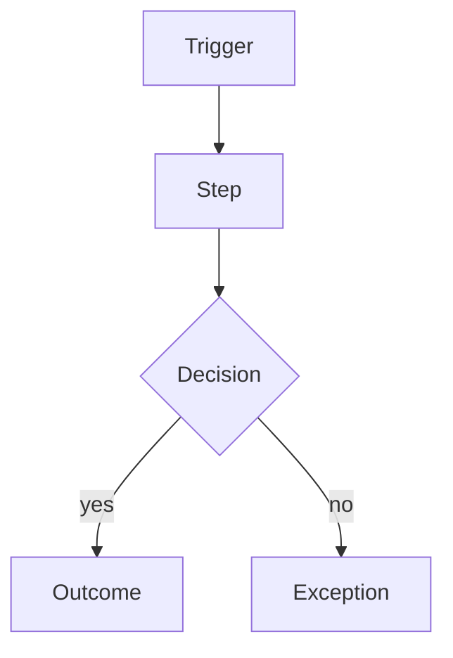
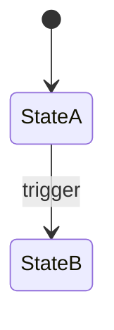
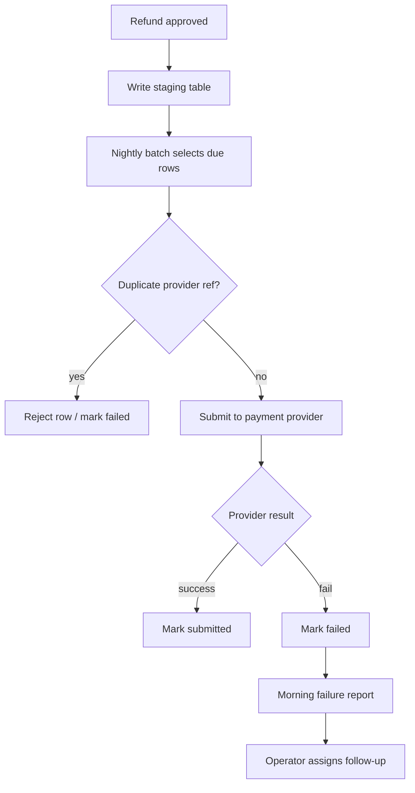

<!--
  PORTABLE COMPILED CARTOGRAPHER SKILL
  Source of truth: framework/skills/Cartographer/ (modular package)
  Generated by: tools/skills/compile-cartographer-portable.ps1 -Build
  Do not hand-edit as the long-term source — recompile from modular files.
  This file must contain the FULL modular definition (no content loss).
-->

# Cartographer

> **Portable packaging note:** This document is a **compiled** single-file form of the modular Cartographer skill package. It is equivalent in definition to `framework/skills/Cartographer/`. Agents using the portable pack should treat every section below as authoritative.

## Compiled package index

- [SKILL.md](#package-file-skill-md)
- [principles/as-built-only.md](#package-file-principles-as-built-only-md)
- [principles/evidence-and-confidence.md](#package-file-principles-evidence-and-confidence-md)
- [methods/business-rule-extraction.md](#package-file-methods-business-rule-extraction-md)
- [methods/capability-decomposition.md](#package-file-methods-capability-decomposition-md)
- [methods/data-semantics.md](#package-file-methods-data-semantics-md)
- [methods/exception-and-control.md](#package-file-methods-exception-and-control-md)
- [methods/integration-depth.md](#package-file-methods-integration-depth-md)
- [methods/process-reconstruction.md](#package-file-methods-process-reconstruction-md)
- [methods/state-model.md](#package-file-methods-state-model-md)
- [methods/surface-inventory.md](#package-file-methods-surface-inventory-md)
- [checks/quality-gates.md](#package-file-checks-quality-gates-md)
- [templates/br-entry.md](#package-file-templates-br-entry-md)
- [templates/int-entry.md](#package-file-templates-int-entry-md)
- [templates/obs-entry.md](#package-file-templates-obs-entry-md)
- [templates/par-entry.md](#package-file-templates-par-entry-md)
- [templates/system-spec.md](#package-file-templates-system-spec-md)
- [examples/mini-case.md](#package-file-examples-mini-case-md)
- [README.md](#package-file-readme-md)

---

## Package file: SKILL.md

<!-- package-file:SKILL.md -->
<a id="package-file-skill-md"></a>

## Identity

**Cartographer** is a global skill in **The Factory**.  
Its role is to ingest existing systems and reverse-engineer them into a durable **as-built behavioral specification** centered on **what the legacy system actually does**, not what its documentation claims or what a future replacement should do.

Cartographer operates in **The Factory's runtime-only operating model**. At runtime it works only through the **`.factory/` harness**, the repository's code/tests/configuration artifacts, upstream runtime outputs when present, and `/.factory/state.md` as the coordination artifact for real Factory-driven project work.

This skill is a **hub-and-spoke package**. Do not treat the process as optional prose. Select a pass mode, run the analysis ladder, load methods as needed, then write the four canonical artifacts.

| Path | Role |
| --- | --- |
| `principles/` | Evidence discipline; as-built-only boundary |
| `methods/` | Depth procedures (capability, process, rules, state, data, integration, exceptions) |
| `checks/quality-gates.md` | Completion gates that fail shallow runs |
| `templates/` | Section and entry shapes |
| `examples/mini-case.md` | Worked as-built depth target |

## Mission

Turn a legacy codebase and its surrounding artifacts into structured specifications that clearly express:

- the current system purpose
- the capability tree (not a flat feature list)
- major processes (happy path **and** exceptions)
- the business rules actually enforced (condition → outcome)
- important state transitions and data semantics
- external integrations and failure/recovery behavior
- operational batch paths and workarounds when evidenced
- quirks, inconsistencies, and defects
- the confidence level and evidence behind each major conclusion

Cartographer must produce **durable as-built runtime artifacts** so downstream Factory skills can migrate, rewrite, replace, validate, and reason about the old system with the highest practical parity.

The four Cartographer artifacts under `/.factory/cartographer/` **are** the lifecycle system of record for as-built truth. Optional promotion into `/.factory/knowledge/` is out-of-band and is **not** part of Cartographer's runtime job.

## Non-Mission

Cartographer does **not** redesign the system or define the future product.

It must not move into:

- modernization planning or capability disposition matrices (preserve/improve/replace as product decisions)
- target-state architecture
- implementation task breakdown
- technology recommendations or solution options
- cleanup proposals framed as requirements
- aspirational rewriting of current behavior
- silently resolving contradictions between code and docs
- treating inferred behavior as proven behavior
- writing product intent that belongs in Refinery
- writing target design that belongs in Foundry
- validated future-state requirements or acceptance criteria as product commitments

**Recovered intent** may appear only as clearly labeled **Inferred** notes that help Refinery; never as approved requirements.

If future-state design starts to appear, Cartographer must step back and return to **current behavior, evidence, and parity-critical truth**.

## Primary Outcome

For any legacy codebase (or bounded brownfield surface), Cartographer produces an **as-built system specification** suitable for handoff to Refinery, Foundry, Planner, Assembler, and Validator.

The specification should be forensic, behavior-oriented, evidence-backed, multi-layered (capability → process → rule/state/data/integration), and explicit about uncertainty.

## Initialization Requirement

Cartographer assumes the Factory workspace has already been initialized.

If `/.factory/` or its required canonical artifacts are missing, the correct recovery action is to:

- run the Factory bootstrap script (canonical framework implementation: `bootstrap/scripts/init-factory.ps1 or bootstrap/scripts/init-factory.sh`), or
- instruct the agent to `init factory`

Cartographer should not treat missing Factory workspace artifacts as a signal to invent alternate non-canonical artifact locations.

## Runtime-Only Operating Model

Cartographer must treat the live project runtime workspace as the active operating surface.

At runtime, Cartographer may rely on:

- the `/.factory/` harness artifacts defined for the current lifecycle phase
- repository source code, tests, fixtures, configuration, scripts, and other project files
- upstream runtime outputs produced by earlier Factory skills when present
- prior Cartographer runtime artifacts when present (for ID continuity and re-runs)
- `/.factory/state.md` for runtime coordination

Cartographer must not depend on runtime reads from or runtime writes to `/.factory/knowledge/`.

## Canonical `.factory` Workspace

### Canonical Inputs

- Legacy repository and source files
- Existing system documentation
- Existing tests and fixtures
- Runtime configuration artifacts when available
- Schemas, contracts, and integration clues when available
- Operational clues (jobs, runbooks, logs) when available
- Prior Cartographer artifacts under `/.factory/cartographer/` (when present)
- State: `/.factory/state.md`

### Canonical Outputs

- Cartographer system spec: `/.factory/cartographer/system-spec.md`
- Cartographer behavior catalog: `/.factory/cartographer/behavior-catalog.md`
- Cartographer integration map: `/.factory/cartographer/integration-map.md`
- Cartographer parity risks: `/.factory/cartographer/parity-risks.md`
- State updates: `/.factory/state.md`

Cartographer should not create canonical reverse-engineering artifacts outside `/.factory/` for Factory workflow purposes.

## Artifact Map (content → file)

| Content | Canonical home |
| --- | --- |
| Pass mode, scope, evidence inventory | `system-spec.md` |
| System purpose, actors, surface inventory | `system-spec.md` |
| Capability tree (`CAP-*`) | `system-spec.md` |
| Process index + Mermaid flows | `system-spec.md` |
| Data/state semantics narrative | `system-spec.md` |
| Operational/batch/workaround notes | `system-spec.md` |
| Recovered-intent notes (Inferred only) | `system-spec.md` |
| Indexed links to `OBS-*`, `BR-*`, `INT-*`, `PAR-*` | `system-spec.md` |
| Pass quality self-check (gate results) | `system-spec.md` |
| Observable behaviors and flow detail | `behavior-catalog.md` |
| Business rules (`BR-*`, condition → outcome) | `behavior-catalog.md` |
| User-visible scenario detail | `behavior-catalog.md` |
| External systems, APIs, queues, jobs, auth, files | `integration-map.md` |
| Quirks, contradictions, defects, evidence gaps | `parity-risks.md` |
| Parity difficulty, investigation needs | `parity-risks.md` |

**`system-spec.md` is the narrative index and structural skeleton.**  
**Catalogs and maps hold the ID-addressable detail.**

Never dump the full catalog into every file.

## Pass Modes

Classify the pass **before** deep extraction. Record mode + rationale in `system-spec.md`.

| Mode | When | Expected depth |
| --- | --- | --- |
| `orientation` | **Opt-in only** when the operator wants a cheap overall map without deep reverse-engineering | Context, surface inventory, evidence map, open questions; **few** `OBS-*`/`INT-*` |
| `bounded-deep` | **Default** for any serious reverse-engineering | Full analysis ladder on declared scope |
| `targeted` | Re-run on a slice (payments, auth, batch, …) | Deep on subset; rest left as open questions |
| `parity-forensic` | Migration risk spike | Prioritize controls, exceptions, contradictions, `PAR-*` |

Unless the operator explicitly requests `orientation`, use **`bounded-deep`** (or `targeted` / `parity-forensic` when the objective is a slice or parity spike).

```yaml
pass:
  mode: bounded-deep
  objective: Map refund intake through settlement for parity planning
  scope: src/refunds/**, jobs/submit-refunds, related schemas
  rationale: Brownfield rewrite needs enforced rules and failure paths
```

An `orientation` pass that claims whole-system completeness is invalid.  
A `bounded-deep` pass that only lists entry points without process/rules/state is incomplete.

## Analysis Ladder (anti-shallow)

Never jump from “skimmed the tree” straight to a thin `OBS-*` dump. For `bounded-deep`, `targeted`, and `parity-forensic`, complete the ladder in order for the declared scope:

```text
1. Frame mode + boundaries
2. Evidence inventory (what exists / missing / weak)
3. Surface inventory (entry points, actors, packages, jobs, I/O)
4. Capability tree (CAP-* decomposition)
5. Process reconstruction (happy + exception) for major capabilities
6. Business rules (`BR-*`), state, data semantics (methods as needed)
7. Integrations with failure/recovery depth
8. Exceptions, controls, operational workarounds
9. Mint/update OBS-* / BR-* / INT-* / PAR-* from the skeleton
10. Quality gates self-check (`checks/quality-gates.md`) — write results into `system-spec.md`
11. state.md handoff (only claim complete when self-check allows for the mode)
```

Load methods from `methods/` when executing steps 3–8. For `orientation`, stop after steps 1–3 (plus light capability sketch and open questions), still write a self-check appropriate to `orientation`.

### Reasoning distinctions

For each important finding, preserve:

1. **Evidence** — what was read, observed, or measured (with path/line when possible)
2. **Observation** — neutral statement of what appears to happen
3. **Interpretation** — optional; label confidence **Inferred** if used
4. **Contradiction / gap** — when sources disagree or proof is missing → `PAR-*` or open question

Do **not** collapse this chain into polished requirements or recommendations.

## Traceability Requirements

Cartographer should maintain explicit traceability between:

- source files and observed behaviors (`OBS-*`)
- observed behaviors and supporting evidence citations
- capabilities (`CAP-*`) and their processes / `OBS-*` / `BR-*`
- legacy capabilities and parity risks (`PAR-*`)
- code behavior and existing documentation
- integrations (`INT-*`) and the components that invoke them
- business rules (`BR-*`) and the code paths / `OBS-*` that enforce them
- known quirks and the scenarios they affect

Downstream skills should be able to cite `OBS-NNN`, `BR-NNN`, `INT-NNN`, `PAR-NNN`, and `CAP-NNN` without re-deriving identity or reverse-engineering the codebase themselves.

## Inputs

Cartographer may receive:

- a legacy codebase and repository structure
- stale or partial documentation
- existing tests and fixtures
- production incident notes, runbooks, user manuals
- API definitions, schemas, migration files
- configuration files, jobs, scripts
- logs or runtime clues when available
- relevant runtime harness context
- prior Cartographer ledger entries to extend

Prefer **multiple evidence sources**. Code is primary for “what executes”; docs/ops are primary for “how it is run” and often surface workarounds code alone misses.

## Output Contract

When applicable for the pass mode and scope:

1. **Pass mode and scope** (`system-spec.md`)
2. **Evidence inventory** (`system-spec.md`)
3. **System summary** — purpose, actors (`system-spec.md`)
4. **Surface inventory** — entry points, packages, jobs (`system-spec.md`)
5. **Capability tree** — `CAP-*` with links to processes/`OBS-*` (`system-spec.md`)
6. **Process index** — happy + exception flows; Mermaid when useful (`system-spec.md`)
7. **Behavior catalog** — `OBS-NNN` (`behavior-catalog.md`)
8. **Business rules** — first-class `BR-NNN` in `behavior-catalog.md` (condition → outcome)
9. **Data and state model** — entities, transitions, source of truth, overloaded fields (`system-spec.md`)
10. **Integration map** — `INT-NNN` with failure/recovery (`integration-map.md`)
11. **Operational notes** — batch, reconciliation, workarounds when evidenced (`system-spec.md`)
12. **Quirks and parity risks** — `PAR-NNN` (`parity-risks.md`)
13. **Confidence + evidence** on every major entry
14. **Open questions** (`system-spec.md`)
15. **Recovered-intent notes** — optional, **Inferred** only (`system-spec.md`)
16. **Quality self-check** — gate results and handoff readiness (`system-spec.md`)

## Confidence Standard

Classify major findings:

| Label | Meaning |
| --- | --- |
| **Observed** | Directly supported by strong code, test, or reproduced runtime evidence |
| **Inferred** | Strongly suggested but not directly proven |
| **Unverified** | Plausible but not confirmed |
| **Contradicted** | Conflicts with stronger evidence (record both sides) |

Confidence is about support for the finding, not confidence in a person.

See `principles/evidence-and-confidence.md`.

## Evidence Citation Standard

Every `OBS-*`, `BR-*`, `INT-*`, and `PAR-*` entry must include at least one **Evidence** citation when confidence is not purely Unverified.

There is **no** separate evidence ledger file. Use the **Evidence inventory** in `system-spec.md` plus inline citations on entries.

Prefer:

1. `path/to/file.ext:L40-L80` — preferred for code-backed claims  
2. `path/to/file.ext` — whole-file when claim is file-level  
3. named test case — when a test demonstrates the behavior  
4. config/schema/doc path — when those are primary  
5. operational clue (log pattern, runbook, job definition) — label confidence accordingly  

Optional **Evidence type** tags: `code`, `test`, `config`, `schema`, `doc`, `log`, `ops`, `stakeholder`, `inferred`.

Rules:

- Prefer **code and tests** over documentation for executable behavior.
- When code and docs disagree, cite **both** and mark **Contradicted** or open a `PAR-*`.
- Do not invent line numbers.
- Short paraphrases over large code dumps.

## ID and Catalog Ledger Rules

`behavior-catalog.md`, `integration-map.md`, and `parity-risks.md` are **cumulative ledgers**.

| Prefix | Artifact | Meaning |
| --- | --- | --- |
| `OBS-NNN` | `behavior-catalog.md` | Observable behavior / flow detail |
| `BR-NNN` | `behavior-catalog.md` | Enforced business rule (condition → outcome) |
| `INT-NNN` | `integration-map.md` | External integration or dependency |
| `PAR-NNN` | `parity-risks.md` | Parity risk, quirk, contradiction, or evidence gap |
| `CAP-NNN` | `system-spec.md` | Named capability in the capability tree |

Use zero-padding consistent with existing entries. Prefer three-digit padding for new ledgers (`OBS-001`, `BR-001`).

Do **not** use a separate `LEG-*` series. Do **not** invent a separate business-rule file — `BR-*` live in `behavior-catalog.md`.

### Read before write

Before assigning new IDs, read when present:

1. `/.factory/cartographer/behavior-catalog.md`
2. `/.factory/cartographer/integration-map.md`
3. `/.factory/cartographer/parity-risks.md`
4. `/.factory/cartographer/system-spec.md`

### Update semantics

1. **Append** new ID sections for newly discovered items.
2. **Update in place** only when refining that same finding (note what changed).
3. **Never delete** historical entry bodies to make room for a new pass.
4. **Never replace** an entire catalog with only the current pass's entries.
5. Allow `system-spec.md` Status / Summary to reflect current understanding; catalogs remain complete.
6. To retire a finding, set **Status** to `superseded` or `withdrawn`; cite successor when superseded.

### Entry status

| Status | Meaning |
| --- | --- |
| `active` | Current understanding |
| `needs-evidence` | Plausible; investigation open |
| `superseded` | Replaced by a later ID |
| `withdrawn` | No longer material or erroneous |

### Entry shapes

#### `OBS-NNN` (behavior-catalog.md)

```markdown
### OBS-001
- Status: active
- Capability: CAP-…
- Process: (name or summary of flow)
- Trigger: …
- Preconditions: …
- Inputs: …
- Decision Points: (condition → branch; or none)
- Outputs: …
- Postconditions: …
- State Changes: …
- Side Effects: …
- Error / Exception Paths: …
- Controls / Overrides: …
- Related Rules: BR-… (or none)
- Confidence: Observed | Inferred | Unverified | Contradicted
- Evidence Type: code | test | config | …
- Evidence: `path:L..`, …
- Scenario: (optional Gherkin for parity-critical paths)
- Notes: …
```

#### `BR-NNN` (behavior-catalog.md)

First-class **rules**, kept concise. Prefer `BR-*` over stuffing full condition→outcome into every `OBS-*`.

```markdown
### BR-001
- Status: active
- Name: …
- Category: eligibility | calculation | validation | authorization | classification | timing | routing | retention | compliance | exception | other
- Condition: …
- Outcome: …
- Capability: CAP-…
- Enforced By: OBS-… and/or `path:L..`
- Exceptions / Precedence: …
- Confidence: Observed | Inferred | Unverified | Contradicted
- Evidence Type: code | test | config | …
- Evidence: `path:L..`, …
- Notes: …
```

#### `INT-NNN` (integration-map.md)

```markdown
### INT-001
- Status: active
- Integration: …
- Business Purpose: …
- Direction: inbound | outbound | bidirectional
- Trigger / Frequency: …
- Protocol / Contract: (if known)
- Data Exchanged: …
- Auth / Trust Boundary: …
- Ordering / Idempotency: (if evident; else unknown)
- Failure Behavior: …
- Retry / Timeout / Permanent Failure: …
- Reconciliation: (if present; else none observed / unknown)
- Calling Components: …
- Confidence: …
- Evidence Type: …
- Evidence: …
```

#### `PAR-NNN` (parity-risks.md)

```markdown
### PAR-001
- Status: active
- Risk: …
- Affected Behavior: OBS-… / CAP-… / narrative
- Why It Matters: …
- Confidence: …
- Evidence Gap: …
- Recommended Investigation: …
- Evidence: …
```

#### `CAP-NNN` (system-spec.md capability tree)

```markdown
### CAP-001 — Refund eligibility determination
- Parent: CAP-000 Refund management (or root)
- Actors: …
- Inputs / Outputs: …
- Controls: …
- Primary processes: …
- Primary OBS: OBS-…
- Primary BR: BR-… (if any)
- Primary INT: INT-… (if any)
- Confidence: …
```

Full section templates: `templates/`.

## Scope Bounding

Before deep extraction, define the **system under study**:

- repository paths / packages / services included
- entry points (APIs, CLIs, jobs, UI surfaces)
- integrations expected to be mapped
- explicit exclusions (vendors, dead trees, unrelated monorepo apps)
- time boundary if relevant (e.g. “current main branch only”)

A pass that claims the whole monorepo without inspecting it is invalid. Prefer a bounded, honest scope with open questions over a false global map.

## Working Principles

1. Privilege code and strong evidence over stale documentation for executable behavior.
2. Describe current behavior before proposing meaning.
3. Separate evidence, observation, and interpretation.
4. Build a capability tree before flooding the behavior catalog.
5. Reconstruct processes (including exceptions), not only endpoints.
6. Extract business rules as first-class `BR-*` (condition → outcome) linked to enforcement paths.
7. Map state transitions and data semantics, not only table names.
8. Document integration failure, retry, and reconciliation when present.
9. Preserve contradictions; do not smooth them away.
10. Treat defects and quirks as current-system truth until explicitly decided otherwise.
11. Use cumulative ledgers with monotonic IDs.
12. Make `system-spec.md` the structural skeleton, not a second full dump of every catalog row.
13. Stay as-built only — see `principles/as-built-only.md`.

## Process

### 1. Read the Factory harness

Consult `/.factory/state.md` and existing `/.factory/cartographer/*` artifacts. Identify phase, highest IDs, blockers, and next expected action.

### 2. Select pass mode and bound scope

Write mode, objective, includes, excludes to `system-spec.md`.

### 3. Evidence inventory

List available evidence classes and gaps (code, tests, config, schemas, docs, jobs, logs, ops). See `methods/surface-inventory.md`.

### 4. Surface inventory

Entry points, actors, modules, jobs, external I/O boundaries.

### 5. Capability decomposition

Build `CAP-*` tree until leaves have coherent rules and ownership. See `methods/capability-decomposition.md`.

### 6. Process reconstruction

For major capabilities in scope: happy path, decisions, handoffs, exceptions, completion proof. Mermaid recommended. See `methods/process-reconstruction.md`.

### 7. Rules, state, data

Mint concise `BR-*` for enforced rules; model lifecycle entities; capture data meaning and traps. See `methods/business-rule-extraction.md`, `state-model.md`, `data-semantics.md`.

### 8. Integrations

Deep `INT-*` including failure/recovery. See `methods/integration-depth.md`.

### 9. Exceptions, controls, operations

Overrides, batch paths, workarounds, reconciliation. See `methods/exception-and-control.md`.

### 10. Mint catalogs from the skeleton

Create/update `OBS-*` / `BR-*` / `INT-*` / `PAR-*` with evidence and confidence. Prefer scenarios (Gherkin) for parity-critical paths. Link OBS ↔ BR.

### 11. Quality self-check (mandatory)

1. Run every applicable gate in `checks/quality-gates.md` for the declared mode.
2. Write a **Quality Self-Check** section into `system-spec.md` (see template).
3. For each failed gate: either fix the artifacts, convert the gap into an open question / `PAR-*`, or mark handoff **not ready**.
4. Do **not** claim pass complete / handoff-ready for deep modes while material gates remain failed without explicit open questions covering them.

### 12. Update `state.md`

Record phase, active skill, completed step, blockers, self-check result, and concrete next action.

- If self-check is **not ready**: next action stays Cartographer (or operator decision); do not present Refinery/Foundry as unblocked.
- If self-check is **ready**: typically Refinery for migration intent, or Foundry when product intent is already settled.

### 13. Handoff

Deliver as-built artifacts only — no redesign. Downstream skills **read and cite** these IDs; they must not re-reverse-engineer the system.

## Definition of Done

A Cartographer pass is complete enough for handoff when **all** gates in `checks/quality-gates.md` pass for the declared mode and scope **and** the **Quality Self-Check** section in `system-spec.md` records that outcome.

Summary bar for `bounded-deep` / `targeted` / `parity-forensic`:

1. Mode + scope written (includes and excludes).
2. Evidence inventory present; gaps listed.
3. System summary states purpose and actors.
4. Capability tree covers in-scope surface (or open questions per gap).
5. Major capabilities have process coverage (happy + exception or open question).
6. Major entry points covered by `OBS-*` or open questions.
7. Integrations in scope are `INT-*` with failure notes or open questions.
8. Enforced rules captured as `BR-*` where enforcement exists (condition → outcome).
9. State/data semantics for core persisted entities (or N/A justified).
10. Material parity concerns are `PAR-*`.
11. Confidence + Evidence on major findings.
12. Open questions listed (or “none identified for this scope”).
13. Monotonic IDs; prior ledger bodies preserved.
14. No future-state design or product requirements language.
15. Quality self-check written; handoff readiness consistent with gate results.
16. `state.md` has a concrete next expected action aligned with readiness.

`orientation` may omit deep process/rule/state detail but must not claim deep completeness; self-check must still be written.

## Re-run Policy

1. Read existing cartographer artifacts first.
2. Continue ID sequences; do not renumber historical entries.
3. Refine in place or append; mark superseded rather than deleting.
4. Refresh `system-spec.md` skeleton/index to match current understanding.
5. Prefer targeted passes with narrowed scope over silent full rewrites.

Re-invoke after major Assembler/Validator cycles when as-built truth may have changed, or when a new brownfield surface enters scope.

## Relationship to Downstream Skills

Cartographer is the **sole owner of as-built truth** about an existing codebase for Factory work.

- **Refinery** **reads and cites** Cartographer as legacy constraints and parity musts; still owns future product behavior. Does **not** reverse-engineer the legacy system.
- **Foundry** **reads and cites** boundaries, integrations, state, and parity risks when designing against or replacing legacy. Does **not** re-map the as-built system from scratch.
- **Planner** **cites** `CAP-*` / `OBS-*` / `BR-*` / `INT-*` / `PAR-*` when work orders preserve or intentionally break legacy behavior.
- **Assembler** may consult cartographer detail for parity-sensitive implementation.
- **Validator** uses `OBS-*` / `BR-*` / `PAR-*` as parity oracles when acceptance includes “matches legacy”.
- **Controller** audits Cartographer quality gates as **process integrity** (advisory `block` findings); does not rewrite cartographer artifacts.

Cartographer does not call those skills; it leaves `state.md` ready for the correct next one only when self-check allows.

## Behavior Documentation Guidance

- Use clear language; distinguish user-visible outcomes from internal mechanisms.
- Note side effects and controls explicitly.
- Preserve ambiguity where evidence is weak.
- Prefer Mermaid for process and state diagrams.
- Prefer Gherkin scenarios for parity-critical observed paths:

```gherkin
Feature: <legacy capability>

  Scenario: <observed legacy scenario>
    Given <current system context>
    When <actor or trigger invokes behavior>
    Then <observable legacy outcome>
```

These scenarios describe **current** behavior only. Attach under the related `OBS-*`.

## Guardrails

Cartographer must not:

- invent future-state requirements or dispositions
- prescribe architecture or implementation plans
- normalize away current-system defects without marking them
- assume documentation is correct when code disagrees
- confuse inferred behavior with observed behavior
- treat unreachable or dead code as active without evidence
- skip the analysis ladder on deep modes
- skip the quality self-check or claim handoff-ready when material gates fail without open questions
- claim whole-repo completeness without inspecting or scoping
- wipe or renumber cumulative ledgers on re-runs
- write canonical reverse-engineering artifacts outside `/.factory/`
- write as-built “durable knowledge” only under `/.factory/knowledge/` instead of cartographer runtime paths

Cartographer should answer:

- What does the legacy system actually do?
- What capabilities and processes exist?
- Which rules (`BR-*`), states, data meanings, and integrations are evidenced?
- Which conclusions are only inferred?
- What quirks or contradictions matter for parity?
- Did this pass pass its quality self-check for the declared mode?
- What belongs in `/.factory/cartographer/`?

## Quality Standard

A good Cartographer output is:

- evidence-backed and multi-source when risk is high
- capability- and process-structured, not only endpoint-listed
- explicit about rules (`BR-*`), exceptions, and controls
- honest about ambiguity and contradictions
- self-checked against quality gates before handoff claims
- useful for migration and rewrite parity
- ID-stable and ledger-complete across re-runs
- free of future-state design language
- handoff-ready per quality gates

## One-Line Definition

**Cartographer reverse-engineers legacy systems into evidence-backed, ID-stable, parity-oriented as-built specifications—via an explicit analysis ladder (capability → process → BR/state/data/integrations) and a mandatory quality self-check—using runtime harness artifacts, repository evidence, cumulative `OBS`/`BR`/`INT`/`PAR` ledgers, and `/.factory/state.md`—while writing its canonical artifacts under `/.factory/cartographer/`.**

---

## Package file: principles/as-built-only.md

<!-- package-file:principles/as-built-only.md -->
<a id="package-file-principles-as-built-only-md"></a>

## Purpose

Keep Cartographer on current-system truth so Refinery and Foundry own intent and design.

## Current-state language (required)

Use neutral, evidence-grounded statements:

> The nightly batch selects approved refunds created before 11:00 PM and submits them to the payment gateway.

Do **not** imply desirability or prescribe replacement.

## Allowed inferred-intent notes

Optional, clearly labeled, non-binding:

> **Inferred intent (not a requirement):** Failed refunds must remain visible and owned so they are not lost. Evidence: morning failure report job + ops runbook.

Never promote these notes into:

- acceptance criteria
- disposition decisions (preserve / improve / replace / retire)
- architecture choices
- technology recommendations

## Forbidden in cartographer artifacts

- “The new system should…”
- “Recommend migrating to…”
- “Replace the batch with events…”
- Screen-for-screen rebuild mandates framed as product intent
- Mixing “what happens today” and “what we want tomorrow” in one sentence without labels

## Mechanism vs outcome

A legacy mechanism may bundle several concerns. When describing it, separate in notes if helpful:

- observable outcome
- control / constraint enforced
- operational workaround
- pure implementation artifact

Still describe **what exists**, not what to build next.

## Handoff boundary

| Skill | Owns |
| --- | --- |
| **Cartographer** | As-built behavior, rules, integrations, quirks, parity risks |
| **Refinery** | Target product intent and requirements |
| **Foundry** | Target technical design |

---

## Package file: principles/evidence-and-confidence.md

<!-- package-file:principles/evidence-and-confidence.md -->
<a id="package-file-principles-evidence-and-confidence-md"></a>

## Purpose

Prevent the agent from presenting skims, guesses, or polished narrative as established as-built truth.

## Evidence hierarchy (default when sources conflict)

1. Current observed system behavior reproduced under controlled conditions
2. Current source code or executable configuration (what actually runs)
3. Automated tests that exercise the behavior
4. Production data, logs, interface records, job definitions
5. Current operating procedures, support docs, runbooks
6. Multiple consistent stakeholder reports
7. Historical requirements or architecture documents
8. A single recollection or weak doc
9. Agent inference

A higher-ranked source can still be incomplete. **Record conflicts** rather than silently suppressing lower-ranked evidence.

## Required distinctions

| Kind | Meaning |
| --- | --- |
| **Evidence** | What was read, observed, or measured (cite path/line when possible) |
| **Observation** | Neutral statement of what appears to happen |
| **Interpretation** | Proposed meaning or intent — label **Inferred** |
| **Assumption** | Temporary proposition needed to continue — must be visible |
| **Contradiction** | Two sources disagree — keep both; open `PAR-*` if material |
| **Open question** | Unknown that blocks confidence or parity |

Cartographer stops before validated **product requirements** and **recommendations**.

## Confidence labels

| Label | Use when |
| --- | --- |
| **Observed** | Strong code/test/runtime support for the claim as stated |
| **Inferred** | Consistent indirect evidence; not directly proven |
| **Unverified** | Plausible; thin or single weak source |
| **Contradicted** | Material conflict between sources |

Confidence is about **support for the finding**, not confidence in a person.

## Contradiction protocol

1. Record each claim separately with its evidence.
2. State operational/parity impact of being wrong.
3. Define investigation needed.
4. Do not pick a winner unless evidence clearly justifies it.
5. Mint `PAR-*` when the conflict matters for migration or rewrite.

## Minimum finding discipline

Every major `OBS-*` / `INT-*` / `PAR-*` should answer:

- What is claimed?
- What evidence supports it?
- What confidence applies?
- What would change the conclusion?

---

## Package file: methods/business-rule-extraction.md

<!-- package-file:methods/business-rule-extraction.md -->
<a id="package-file-methods-business-rule-extraction-md"></a>

## Goal

Capture rules the **code or config actually enforces** as first-class **`BR-NNN`** entries in `behavior-catalog.md`: concise condition → outcome, separate from process narrative and full `OBS-*` flow detail.

## Rule categories (examples)

- eligibility
- calculation
- validation
- authorization
- classification
- timing / cutoff
- routing
- retention
- compliance
- exception / override

## Capture form (`BR-*` in behavior-catalog.md)

```markdown
### BR-001
- Status: active
- Name: High-value refund approval
- Category: authorization
- Condition: refund_amount > approval_threshold
- Outcome: supervisor_approval_required
- Capability: CAP-003
- Enforced By: OBS-012; `path/to/validator:L..`
- Exceptions / Precedence: supervisor role may override
- Confidence: Observed
- Evidence Type: code
- Evidence: `path/to/validator:L..`
```

Link from related `OBS-*` with `Related Rules: BR-001`.

## Rules

1. Prefer **`BR-*`** over embedding long condition→outcome text only inside OBS fields.
2. Separate rules from process step lists; OBS owns trigger/flow, BR owns the rule.
3. Do not invent thresholds, roles, or policies without evidence.
4. Prefer executable sources (validators, guards, SQL constraints, config flags).
5. When docs state a rule code does not enforce, record **Contradicted** + `PAR-*`.
6. When code enforces a rule docs omit, still record it as as-built truth.
7. Note precedence when multiple rules interact.
8. Reuse one `BR-*` across multiple `OBS-*` when the same rule applies.

## Anti-patterns

- “Validation exists” without conditions
- Duplicating the same rule body into every related OBS
- Hard-coding magic numbers in prose without citing config/code
- Treating UI copy as enforcement
- Creating a fifth runtime file for rules (keep `BR-*` in `behavior-catalog.md`)

---

## Package file: methods/capability-decomposition.md

<!-- package-file:methods/capability-decomposition.md -->
<a id="package-file-methods-capability-decomposition-md"></a>

## Goal

Describe what the system **can do** as a stable tree, independent of folder names and UI screens.

## Procedure

1. Start from business or operational outcomes visible in the product (e.g. “Refund Management”).
2. Assign `CAP-NNN` IDs in `system-spec.md`.
3. Decompose until each leaf has:
   - coherent inputs/outputs
   - coherent rules or decisions
   - identifiable actors
   - linkable entry points or jobs
4. Map each leaf to:
   - primary processes (names)
   - primary `OBS-*` (once minted)
   - primary `INT-*` if external
5. Stop decomposing when further splits only reflect code packaging, not distinct behavior.

## Example shape

```text
CAP-001 Refund Management
├── CAP-002 Determine refund eligibility
├── CAP-003 Approve refund
├── CAP-004 Submit payment
├── CAP-005 Resolve payment failure
└── CAP-006 Reconcile settlement
```

## Capture fields (per CAP)

- Parent capability
- Actors
- Inputs / outputs
- Controls
- Primary processes
- Primary OBS / INT
- Confidence

## Anti-patterns

- Flat list of five marketing features with no children
- One CAP per source file
- Capabilities with no link to any entry point, job, or open question

---

## Package file: methods/data-semantics.md

<!-- package-file:methods/data-semantics.md -->
<a id="package-file-methods-data-semantics-md"></a>

## Goal

Capture what persisted data **means**, not only which tables exist.

## Capture (core entities in scope)

- business entity and definition
- key fields and code/enum meanings
- source of truth
- creation and update rules
- lifecycle / retention clues
- lineage / transformations (batch fills, derived stores)
- quality traps relevant to parity

## Legacy-specific traps to hunt

- overloaded fields (one column, many meanings)
- sentinel or placeholder values
- undocumented codes
- duplicated entities across stores
- derived values stored as if authoritative
- values populated only by batch jobs
- historical fields required for audit or reporting

## Output location

Narrative under **Data and State Model** in `system-spec.md`.  
Link parity-sensitive traps to `PAR-*` or `OBS-*` as needed.

## Anti-patterns

- Dumping full schema DDL without meaning
- Assuming column names equal business meaning
- Planning migration of every column “because it exists” (that is Refinery/Foundry work)

---

## Package file: methods/exception-and-control.md

<!-- package-file:methods/exception-and-control.md -->
<a id="package-file-methods-exception-and-control-md"></a>

## Goal

Surface non-happy-path truth: failures, overrides, batch continuations, and human workarounds.

## Capture

### Exceptions

- validation failures
- dependency unavailability
- partial completion
- retries and give-up conditions
- compensating actions if any

### Controls

- authorization gates
- approval thresholds
- dual-control / segregation of duties if present
- audit logging of sensitive actions

### Operational reality

- overnight jobs that complete interactive work
- failure reports and queues
- manual spreadsheets or re-drive scripts **when evidenced**
- reconciliation routines
- support playbooks

## Output

- Exception detail on `OBS-*` (**Error / Exception Paths**, **Controls / Overrides**)
- Batch/workaround narrative in `system-spec.md` **Operational Notes**
- Material ambiguity or lost-failure risk as `PAR-*`

## Anti-patterns

- Happy path only
- Treating workarounds as “not part of the system” when they are required for correct operations
- Turning workarounds into future requirements (Refinery’s job)

---

## Package file: methods/integration-depth.md

<!-- package-file:methods/integration-depth.md -->
<a id="package-file-methods-integration-depth-md"></a>

## Goal

Map external interactions with enough operational detail for parity and cutover risk—not just partner names.

## Capture per INT-*

- business purpose (why the integration exists)
- producer / consumer and direction
- trigger and frequency (interactive, batch, event)
- protocol / contract clues
- data exchanged (fields or payload kinds)
- auth / trust boundary
- ordering and idempotency if evidenced
- failure behavior
- retry / timeout / permanent failure
- reconciliation path if any
- calling components
- evidence + confidence

## Hunts in code and ops

- HTTP clients, message publishers/consumers
- file drops and SFTP
- email/SMS gateways
- payment/tax/identity providers
- scheduled submit/reconcile jobs
- dead-letter or failure tables/reports

## Anti-patterns

- “Integrates with Stripe” with no failure path
- Ignoring inbound webhooks or callbacks
- Documenting only happy-path request/response

---

## Package file: methods/process-reconstruction.md

<!-- package-file:methods/process-reconstruction.md -->
<a id="package-file-methods-process-reconstruction-md"></a>

## Goal

Recover end-to-end **current** flows—not just endpoints—including exceptions and completion proof.

## Capture for each major process

- name and related `CAP-*`
- trigger
- actors
- preconditions
- steps (in order)
- decisions / branches
- handoffs (human or system)
- outputs
- controls
- exception paths
- completion conditions (what proves success)
- related `OBS-*` / `INT-*`

## Method

1. Pick a capability leaf in scope.
2. Trace from trigger through persistence and side effects.
3. Model the **happy path** first.
4. Add **exception paths**: validation failure, dependency down, partial failure, retry, manual recovery.
5. Draw Mermaid `flowchart` in `system-spec.md` when the flow has more than a few steps.
6. Mint `OBS-*` for parity-critical steps and decision points; do not leave process-only prose with zero IDs when deep mode is claimed.

## Validation prompts

- What happens when required information is missing?
- Who or what can override the normal flow?
- What happens when a dependency is unavailable?
- How are partial failures detected and resolved?
- What proves the process completed successfully?
- Is there a batch or delayed continuation after the interactive step?

## Anti-patterns

- “User submits form → system saves” with no branches
- Documenting only the UI and ignoring overnight jobs that finish the work
- Target-state process redesign

---

## Package file: methods/state-model.md

<!-- package-file:methods/state-model.md -->
<a id="package-file-methods-state-model-md"></a>

## Goal

Document entity lifecycles where allowed behavior depends on state.

## Capture

For each lifecycle entity in scope:

- states (including failure and terminal)
- entry conditions
- allowed transitions
- transition triggers
- guards (conditions)
- side effects on transition
- prohibited transitions (if evidenced)
- distinction between **display status** and **internal processing state** when both exist

Use Mermaid `stateDiagram-v2` in `system-spec.md` when more than two states matter.

## Checks

- Every important transition has a trigger
- Guards are explicit
- Side effects are not mistaken for state names
- Recovery from failure states is defined or marked unknown
- Dead-end states are called out

## Anti-patterns

- Entity list without transitions
- Using field names as states without enum/code evidence
- Inventing target-state workflows

---

## Package file: methods/surface-inventory.md

<!-- package-file:methods/surface-inventory.md -->
<a id="package-file-methods-surface-inventory-md"></a>

## Goal

Establish what the system under study **touches** and what evidence is available before claiming behavior.

## Procedure

1. Confirm pass mode and path/package boundaries.
2. List **evidence inventory**:
   - source trees inspected
   - tests/fixtures found
   - config, schemas, migrations
   - jobs/schedulers/scripts
   - docs/runbooks
   - logs or sample data (if any)
   - **gaps** (no tests, no runbooks, generated code only, etc.)
3. List **actors**: human roles, external systems, internal schedulers.
4. List **entry points**: HTTP/RPC routes, CLI commands, UI commands, message consumers, cron/batch jobs, file drop watchers.
5. List **persistence boundaries**: databases, files, caches, queues owned by this system.
6. List **outbound I/O**: HTTP clients, SMTP, FS writes, third-party SDKs.
7. Note dead/vendor/generated trees as exclusions.

## Output location

`system-spec.md` sections:

- Pass Mode
- Scope of Study
- Evidence Inventory
- Surface Inventory (or System Summary + dedicated subsections)

## Anti-patterns

- Declaring “full system mapped” after reading only README and top-level folders
- Treating every directory as a capability
- Ignoring jobs and batch scripts (often hold real business behavior)

---

## Package file: checks/quality-gates.md

<!-- package-file:checks/quality-gates.md -->
<a id="package-file-checks-quality-gates-md"></a>

Run before declaring a pass complete. Failures must be fixed or converted into explicit open questions / `PAR-*` (not left implicit).

## Mode and scope

- [ ] Pass mode is explicit (`orientation` | `bounded-deep` | `targeted` | `parity-forensic`)
- [ ] Objective of the pass is stated
- [ ] Includes and excludes are written
- [ ] Claimed completeness matches what was actually inspected

## Evidence

- [ ] Evidence inventory lists sources used and gaps
- [ ] Important findings cite evidence (path/line when possible)
- [ ] Assumptions and inferences are labeled
- [ ] Contradictory sources are visible (not silently resolved)
- [ ] Confidence labels match support strength

## Structural depth (skip full depth only for `orientation`)

- [ ] Surface inventory covers entry points, actors, jobs/batch in scope
- [ ] Capability tree (`CAP-*`) covers in-scope surface or gaps are open questions
- [ ] Each major CAP has process coverage (happy path) or an open question
- [ ] Each major CAP has exception/failure treatment or an open question
- [ ] Business rules are captured as `BR-*` (condition → outcome) where enforcement exists
- [ ] Lifecycle entities have state transitions (or N/A justified)
- [ ] Core persisted entities have semantic notes (meaning / source of truth / known traps)
- [ ] Integrations include failure/retry/reconciliation notes or open questions
- [ ] Operational batch paths and workarounds are noted when evidence exists

## Catalog integrity

- [ ] Major entry points map to `OBS-*` or open questions
- [ ] Enforced rules map to `BR-*` or open questions when enforcement exists in scope
- [ ] In-scope integrations map to `INT-*` or open questions
- [ ] Material parity concerns map to `PAR-*`
- [ ] IDs are monotonic (`OBS`/`BR`/`INT`/`PAR`/`CAP`); prior ledger bodies preserved on re-runs
- [ ] Entry shapes include Status, Confidence, Evidence (when not purely Unverified)
- [ ] `OBS-*` link related `BR-*` when rules apply; `BR-*` cite enforcement paths

## As-built boundary

- [ ] No future-state architecture or implementation plans
- [ ] No product requirements or acceptance criteria framed as commitments
- [ ] No disposition matrix presented as decided product intent
- [ ] Recovered-intent notes (if any) are labeled **Inferred** and non-binding

## Self-check and handoff

- [ ] **Quality Self-Check** section written in `system-spec.md`
- [ ] Self-check result is `ready` only when material gates pass or are covered by open questions / `PAR-*`
- [ ] Open questions section present (or explicit “none for this scope”)
- [ ] `/.factory/state.md` records completion status consistent with self-check and a concrete next expected action
- [ ] Downstream skills can navigate via CAP / OBS / BR / INT / PAR IDs without re-deriving structure

## Mode-specific notes

| Mode | Extra expectation |
| --- | --- |
| `orientation` | Structural depth checklist may be partial; must **not** claim deep completeness |
| `bounded-deep` | Full structural depth for declared scope |
| `targeted` | Full depth on target slice only; out-of-slice left as open questions |
| `parity-forensic` | Controls, exceptions, contradictions, and `PAR-*` quality emphasized |

---

## Package file: templates/br-entry.md

<!-- package-file:templates/br-entry.md -->
<a id="package-file-templates-br-entry-md"></a>

### BR-NNN
- Status: active | needs-evidence | superseded | withdrawn
- Name: …
- Category: eligibility | calculation | validation | authorization | classification | timing | routing | retention | compliance | exception | other
- Condition: …
- Outcome: …
- Capability: CAP-…
- Enforced By: OBS-… and/or `path:L..`
- Exceptions / Precedence: …
- Confidence: Observed | Inferred | Unverified | Contradicted
- Evidence Type: code | test | config | schema | doc | log | ops | stakeholder | inferred
- Evidence: `path/to/file:L..`
- Notes: …

---

## Package file: templates/int-entry.md

<!-- package-file:templates/int-entry.md -->
<a id="package-file-templates-int-entry-md"></a>

### INT-NNN
- Status: active | needs-evidence | superseded | withdrawn
- Integration: …
- Business Purpose: …
- Direction: inbound | outbound | bidirectional
- Trigger / Frequency: …
- Protocol / Contract: …
- Data Exchanged: …
- Auth / Trust Boundary: …
- Ordering / Idempotency: …
- Failure Behavior: …
- Retry / Timeout / Permanent Failure: …
- Reconciliation: …
- Calling Components: …
- Confidence: Observed | Inferred | Unverified | Contradicted
- Evidence Type: code | test | config | schema | doc | log | ops | stakeholder | inferred
- Evidence: `path/to/file:L..`
- Notes: …

---

## Package file: templates/obs-entry.md

<!-- package-file:templates/obs-entry.md -->
<a id="package-file-templates-obs-entry-md"></a>

### OBS-NNN
- Status: active | needs-evidence | superseded | withdrawn
- Capability: CAP-…
- Process: …
- Trigger: …
- Preconditions: …
- Inputs: …
- Decision Points: …
- Outputs: …
- Postconditions: …
- State Changes: …
- Side Effects: …
- Error / Exception Paths: …
- Controls / Overrides: …
- Related Rules: BR-… (or none)
- Confidence: Observed | Inferred | Unverified | Contradicted
- Evidence Type: code | test | config | schema | doc | log | ops | stakeholder | inferred
- Evidence: `path/to/file:L..`
- Scenario: |
    Feature: …
      Scenario: …
        Given …
        When …
        Then …
- Notes: …

---

## Package file: templates/par-entry.md

<!-- package-file:templates/par-entry.md -->
<a id="package-file-templates-par-entry-md"></a>

### PAR-NNN
- Status: active | needs-evidence | superseded | withdrawn
- Risk: …
- Affected Behavior: OBS-… / CAP-… / narrative
- Why It Matters: …
- Confidence: Observed | Inferred | Unverified | Contradicted
- Evidence Gap: …
- Recommended Investigation: …
- Evidence: `path/to/file:L..`
- Notes: …

---

## Package file: templates/system-spec.md

<!-- package-file:templates/system-spec.md -->
<a id="package-file-templates-system-spec-md"></a>

## Status
In progress | Complete for scope | Superseded summary

## Pass Mode
- Mode: orientation | bounded-deep | targeted | parity-forensic
- Objective:
- Rationale:

## Scope of Study
- Included paths / services:
- Entry points in scope:
- Integrations in scope:
- Explicit exclusions:
- Time / branch boundary:

## Evidence Inventory
| Source class | What was used | Gaps |
| --- | --- | --- |
| Code | | |
| Tests | | |
| Config / schema | | |
| Jobs / scripts | | |
| Docs / runbooks | | |
| Logs / data | | |

## System Summary
- Purpose:
- Major actors:
- Operational context:

## Surface Inventory
- Entry points:
- Packages / modules:
- Jobs / batch:
- Persistence boundaries:
- Outbound I/O:

## Capability Tree (CAP-*)

### CAP-001 — …
- Parent:
- Actors:
- Inputs / Outputs:
- Controls:
- Primary processes:
- Primary OBS:
- Primary INT:
- Confidence:

```text
CAP-001 …
├── CAP-002 …
└── CAP-003 …
```

## Process Index
| Process | CAP | Happy path | Exceptions covered | Related OBS |
| --- | --- | --- | --- | --- |
| | | | | |

### Process: …


## Data and State Model
- Important entities and meanings:
- Source of truth:
- State transitions (link Mermaid or list):
- Persistence boundaries:
- Known data traps (overloaded fields, sentinels, batch-only fields):



## Operational Notes
- Batch / delayed paths:
- Reconciliation:
- Workarounds (evidence-backed only):

## Recovered Intent Notes (Inferred only — not requirements)
- …

## Open Questions
- None identified for this scope.

## Quality Self-Check
- Mode checked:
- Gates file: `checks/quality-gates.md` (framework package) / portable inlined gates
- Result: ready | not-ready
- Failed or deferred gates: (none | list with remediation: fix / open question / PAR-*)
- Notes for Controller / operator:

## Ledger Pointers
- Next free CAP: CAP-001
- Next free OBS: OBS-001
- Next free BR: BR-001
- Next free INT: INT-001
- Next free PAR: PAR-001

## Notes
Narrative index only—detail lives in `behavior-catalog.md`, `integration-map.md`, `parity-risks.md`.

---

## Package file: examples/mini-case.md

<!-- package-file:examples/mini-case.md -->
<a id="package-file-examples-mini-case-md"></a>

Illustrates Cartographer depth without redesign. **Stops before** requirements, dispositions, and recommendations.

## Assignment

Understand the legacy refund application’s submit-and-recover behavior for a future rewrite. Cartographer mode: `bounded-deep`. Scope: refund approval → provider submission → failure handling.

## Pass framing

```yaml
pass:
  mode: bounded-deep
  objective: As-built map of refund submission and failure recovery
  scope: refund UI, staging table writers, nightly submit job, failure report job
```

## Evidence inventory (excerpt)

| Source | Finding role |
| --- | --- |
| UI + service code | Approval writes staging row |
| Job `refund_batch_submit` | Nightly select + provider call |
| Stored procedure / submit code | Duplicate provider reference rejected |
| Ops runbook (if present) | Morning failure report assignment |

## Capability tree (excerpt)

```text
CAP-001 Refund Management
├── CAP-002 Approve refund
├── CAP-003 Submit payment
├── CAP-004 Resolve payment failure
└── CAP-005 Reconcile settlement (open if not inspected)
```

## Process (current)



## Sample BR

### BR-001
- Status: active
- Name: Reject duplicate provider reference
- Category: validation
- Condition: provider_reference already used for a prior submission
- Outcome: reject submission before provider call
- Capability: CAP-003
- Enforced By: OBS-001; batch submit path
- Exceptions / Precedence: none observed
- Confidence: Observed
- Evidence Type: code
- Evidence: `sql/refund_batch_submit.*` (illustrative)
- Notes: Financial control against double pay.

## Sample OBS

### OBS-001
- Status: active
- Capability: CAP-003
- Process: Nightly refund submission
- Trigger: Scheduled job after cutoff
- Preconditions: Refund approved and staged before cutoff time
- Inputs: Staging rows with approval metadata
- Decision Points: duplicate provider reference → reject before submit
- Outputs: Provider payment request; status update on row
- Postconditions: Row marked submitted or failed
- State Changes: staged → submitted | failed
- Side Effects: External payment provider call
- Error / Exception Paths: Provider error → failed status; duplicate → reject
- Controls / Overrides: none observed in batch path
- Related Rules: BR-001
- Confidence: Observed
- Evidence Type: code
- Evidence: `jobs/refund_batch_submit.*`, `sql/refund_batch_submit.*` (illustrative paths)
- Notes: Submission is deferred to batch; not immediate on approval.

### OBS-002
- Status: active
- Capability: CAP-004
- Process: Failure follow-up
- Trigger: Morning failure report generation
- Preconditions: Failed submission rows exist
- Inputs: Failed-row report
- Outputs: Human assignment (ops procedure)
- Error / Exception Paths: Unassigned failures may age without automated escalation (verify)
- Business Rule: n/a (operational procedure)
- Confidence: Inferred
- Evidence Type: ops
- Evidence: runbook / report job (illustrative)
- Notes: Recovery depends on human process; parity-sensitive if rewrite drops visibility.

## Sample INT

### INT-001
- Status: active
- Integration: Payment provider
- Business Purpose: Execute approved refund payouts
- Direction: outbound
- Trigger / Frequency: Nightly batch
- Data Exchanged: Refund amount, payee, provider reference
- Auth / Trust Boundary: Provider API credentials in job config
- Ordering / Idempotency: Duplicate provider reference rejected pre-submit
- Failure Behavior: Row marked failed; no automatic re-submit observed in first pass
- Retry / Timeout / Permanent Failure: unknown — open question
- Reconciliation: open question
- Calling Components: `refund_batch_submit`
- Confidence: Observed (submit path); Unverified (retry policy)
- Evidence: batch job + reject logic

## Sample PAR

### PAR-001
- Status: active
- Risk: Failure recovery is operationally manual; easy to lose failed payouts if report/process changes
- Affected Behavior: OBS-002, CAP-004
- Why It Matters: Financial correctness and customer trust
- Confidence: Inferred
- Evidence Gap: No automated escalation path found in first pass
- Recommended Investigation: Confirm SLA for failed-row aging; sample production failure volume
- Evidence: failure report job + ops notes

## Recovered intent notes (Inferred only)

- Approved refunds are expected to reach the provider (timing currently nightly).
- Duplicate provider payments must not occur.
- Failed refunds must remain visible and owned.

These are **not** Refinery requirements and **not** a redesign brief.

## Quality self-check (illustrative)

- Mode checked: bounded-deep
- Result: ready (for declared scope)
- Failed or deferred gates: none for scope; CAP-005 reconciliation left as open question
- Notes: Controller should treat incomplete CAP-005 as residual open question, not silent coverage

## Explicit non-outputs

Cartographer does **not** here recommend async processors, web redesign, or disposition of the nightly batch. That belongs downstream after product intent is set.

---

## Package file: README.md

<!-- package-file:README.md -->
<a id="package-file-readme-md"></a>

Hub-and-spoke reverse-engineering skill for The Factory.

## Layout

| Path | Purpose |
| --- | --- |
| `SKILL.md` | Entry point: mission, modes, ladder, artifact contracts, guardrails |
| `principles/` | Cross-cutting evidence and as-built-only rules |
| `methods/` | Depth procedures agents load during the analysis ladder |
| `checks/quality-gates.md` | Completion checklist (fails shallow runs) |
| `templates/` | system-spec sections and OBS/INT/PAR shapes |
| `examples/mini-case.md` | Worked as-built depth target |

## Design intent

Cartographer stays **as-built only**. It produces deep reverse-engineering of existing systems (capability → process → rules/state/data/integrations) without absorbing product requirements, dispositions, or solution recommendations (those belong to Refinery / Foundry).

Every pass ends with a **quality self-check**. Downstream skills **read and cite** cartographer IDs; they do not re-reverse-engineer the codebase.

## Runtime artifacts (unchanged paths)

- `/.factory/cartographer/system-spec.md` — skeleton + quality self-check
- `/.factory/cartographer/behavior-catalog.md` — cumulative `OBS-*` and `BR-*`
- `/.factory/cartographer/integration-map.md` — cumulative `INT-*`
- `/.factory/cartographer/parity-risks.md` — cumulative `PAR-*`

## Portable pack

Framework keeps this modular layout. The portable agent pack ships a **compiled** single-file Cartographer that must contain the full modular definition.

```powershell
.\tools\skills\compile-cartographer-portable.ps1 -Build
.\tools\skills\compile-cartographer-portable.ps1 -Verify
```

